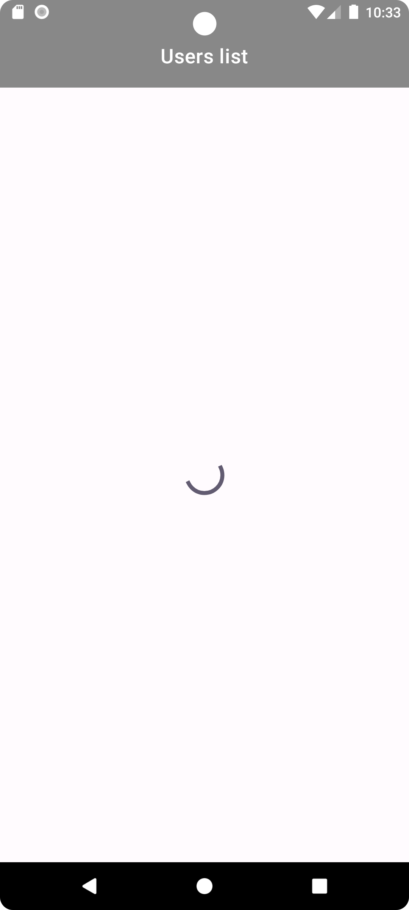
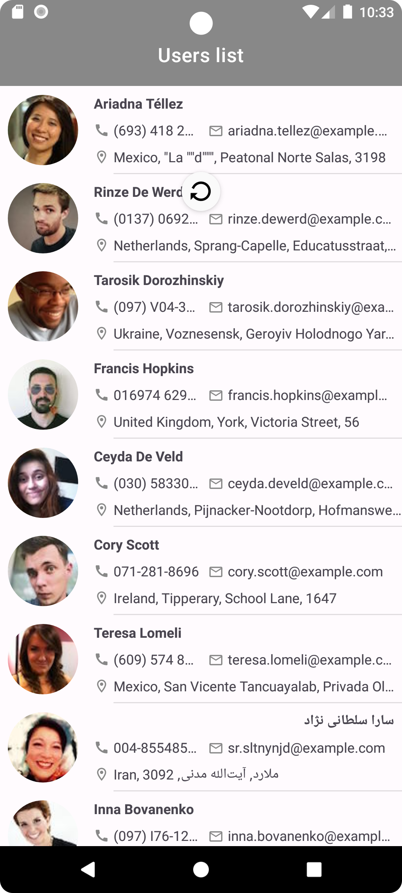
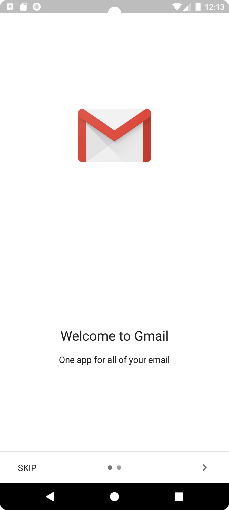
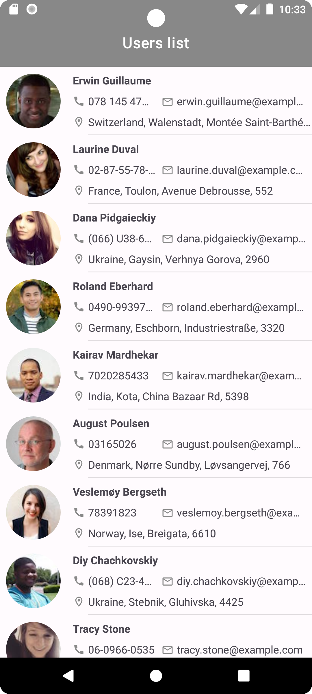
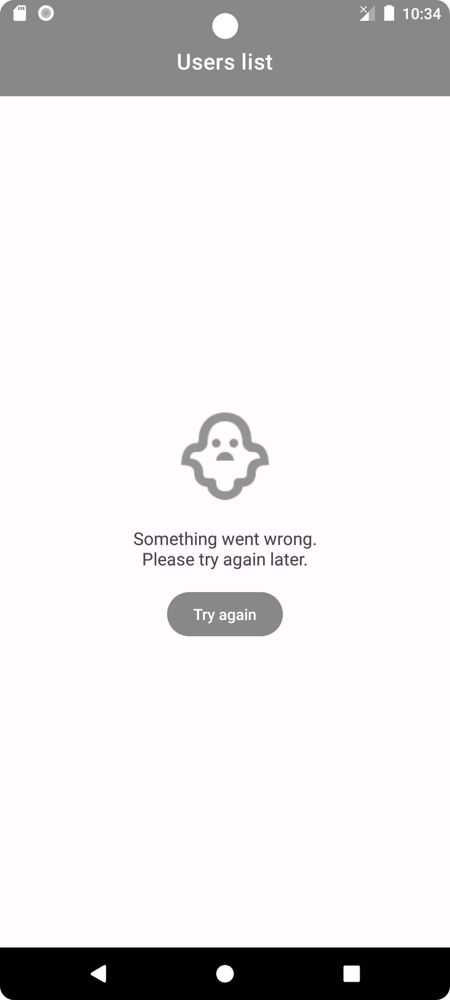

# RandomUserApp

### Описание задачи

Реализовать Android-приложение со следующими функциями:
- Выводится краткая информация о пользователях (ФИО, фотография, адрес, номер
телефона) в виде списка, полученная от [сервера](https://randomuser.me)
- По клику на элемент списка на отдельном экране показывается полная информация о
выбранном пользователе
- Данные о пользователях не теряются при перезапуске приложения
- Нажатие на Email, номер телефона, адрес/координаты отправляет пользователя в
приложение, которое может обработать эти данные (почта, звонилка, карты)
- Список пользователей можно обновить принудительно
- Пользователю выводятся уведомления о возникших ошибках при загрузке данных или
работе с ними

### Реализация

<p>
  Приложение позволяет загружать список случайных пользователей с сервера, просматривать детальную информацию о каждом из них, 
  а также по клику на телефон, email или адрес переходить в соответствующее приложение (звонилка, почта, карты).
</p>

<p align="center">  
    
    
    
</p>

<p>
  Список пользователей можно обновить скроллом.
</p>

<p align="center">  
    
    
    
</p>

<p>
  При неудачной загрузке данных выводится сообщение об ошибке с предложением повторить попытку.
</p>

<p align="center">  
    
</p>

### Запуск приложения

Клонировать ветку `master` этого репозитория и импортировать в **Android Studio**
```bash
https:
https://github.com/tprobius/RandomUserApp.git
```

или

```bash
ssh:
git@github.com:tprobius/RandomUserApp.git
```

Запустить на эмуляторе утройства в Android Studio.

### Генерация APK

В Android Studio:
1. ***Build*** menu
2. ***Generate APK...***
3. Установить приложение на телефон.

### Стек

Проект реализован с применением подхода Clean Architecture и MVVM + UDF. 

- Kotlin
- View binding
- Coroutine
- Koin
- Room
- Retrofit
- Gson
- Glide
- Cicerone

### Backlog

- [ ] Реализовать поддержку тёмной темы.
