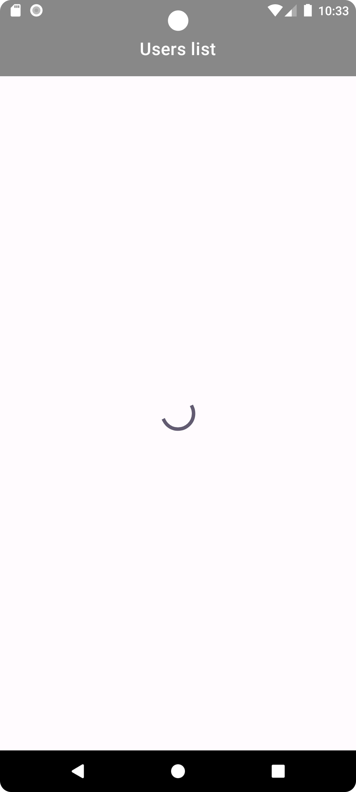

# RandomUserApp

### Task 

Implement an Android application with the following functions:
- Displays brief users info (full name, photo, address, phone number) received from [server](https://randomuser.me) as a list
- By clicking on an list item, full information about the selected user is displayed on a separate screen
- User data is saved when restarting the application
- Clicking on Email, phone number, location calls up an application that can process this data (mail, caller, maps)
- The users list can be updated
- The user is notified of any errors that occurred when loading or working with the data

### Realization

<p>
  The application allows you to get a list of random users from the server, view detailed information about each of them, 
  and by clicking on a phone, email or address go to the corresponding application (caller, mail, maps).
</p>

<p align="center">  
    
    
    
</p>

<p>
  The list of users can be refreshing by using the pull-to-refresh gesture.
</p>

<p align="center">  
    
    
    
</p>

<p>
  On failure data loading, an error message is displayed with a suggestion to try again.
</p>

<p align="center">  
    
</p>

### Application launch

Clone the `master` branch of this repository and import it into **Android Studio**
```bash
https:
https://github.com/tprobius/RandomUserApp.git
```

or

```bash
ssh:
git@github.com:tprobius/RandomUserApp.git
```

Run on the device emulator in Android Studio.

### APK generation

In Android Studio:
1. ***Build*** menu
2. ***Generate APK...***
3. Install the app on your phone.

### Tech stack

The project was implemented using the Clean Architecture approach and MVVM + UDF.

- Kotlin
- View binding
- Coroutine
- Koin
- Room
- Retrofit
- Gson
- Glide
- Cicerone

### Backlog

- [ ] Implement night mode support.
- [ ] Cover business logic with tests.
